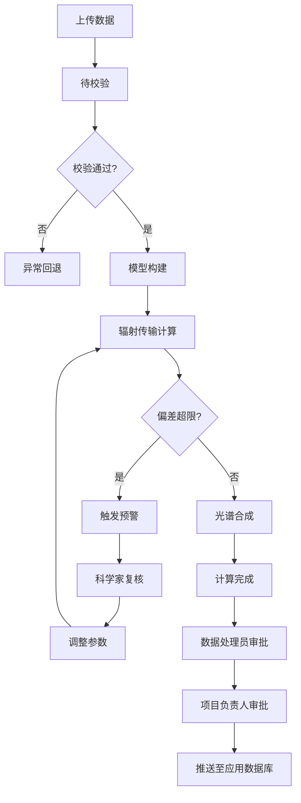
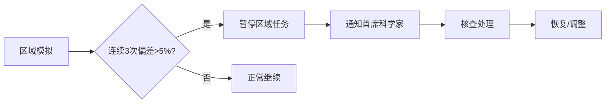

## 1. 产品概述

高精度大气辐射传输与遥感模拟平台是面向遥感科学家和数据处理团队的专业级模拟系统，支持大气垂直廓线参数上传、逐线积分辐射传输建模、多光谱波段计算、实时监控预警、两级审批流程及智能推荐等核心功能，为遥感应用提供高精度的辐射传输模拟与反演产品。

- **核心目标**：构建完整的大气辐射传输模拟工作流，从数据上传到最终产品交付全流程自动化
- **目标用户**：遥感科学家、数据处理员、项目负责人、首席科学家
- **产品价值**：提升模拟精度、加速科研产出、规范审批流程、智能优化参数

## 2. 核心功能

### 2.1 用户角色

| 角色 | 注册方式 | 核心权限 |
|------|----------|----------|
| 遥感科学家 | 系统分配 | 上传数据、创建模拟、监控计算、复核预警、调整参数 |
| 数据处理员 | 系统分配 | 验证模型合理性、提交审批、查看模拟结果 |
| 项目负责人 | 系统分配 | 确认反演产品质量、审批通过、查看统计看板 |
| 首席科学家 | 系统分配 | 区域异常处理、全局配置、高级权限 |

### 2.2 功能模块

1. **工作台仪表板**：概览统计、任务快捷入口、预警通知、性能趋势
2. **任务管理中心**：任务列表、创建任务、状态流转追踪、详情查看
3. **实时监控中心**：大气透过率监控、地表反射率监控、卫星通道亮温监控
4. **预警通知中心**：多级预警列表、预警详情、复核操作、预警历史
5. **审批工作流**：待审批列表、审批操作、审批历史、两级审批流转
6. **报告生成中心**：综合报告预览、PDF导出、多光谱曲线、亮温分布图
7. **智能推荐引擎**：最优波段推荐、大气校正参数推荐、历史模拟分析
8. **统计看板**：模拟完成率、平均反演精度、计算资源消耗、性能趋势图

### 2.3 页面详情

| 页面名称 | 模块名称 | 功能描述 |
|----------|----------|----------|
| 工作台 | 统计概览卡片 | 展示总任务数、进行中、待审批、预警数等关键指标 |
| 工作台 | 快捷操作区 | 快速创建模拟、上传数据、查看报告等入口 |
| 工作台 | 实时预警面板 | 展示最新预警信息，支持快速跳转复核 |
| 工作台 | 性能趋势图 | 展示近7/30天模拟完成率和精度趋势 |
| 任务管理 | 任务列表 | 支持按状态、时间、区域筛选，分页展示 |
| 任务管理 | 创建任务向导 | 分步引导：上传数据→配置参数→确认提交 |
| 任务管理 | 任务详情页 | 展示任务全量信息：状态时间线、参数配置、计算结果、审批记录 |
| 任务管理 | 状态流转可视化 | 待校验→模型构建→辐射传输计算→光谱合成→完成/异常回退 |
| 实时监控 | 大气透过率图表 | 多波段透过率曲线实时更新，支持波段选择 |
| 实时监控 | 地表反射率图表 | 不同下垫面类型反射率对比，时间序列展示 |
| 实时监控 | 卫星通道亮温 | 多通道亮温数值与分布图，热力图可视化 |
| 预警中心 | 预警列表 | 按级别（一级/二级/三级）筛选，支持搜索 |
| 预警中心 | 预警详情 | 展示预警原因、偏差数值、关联任务、处理建议 |
| 预警中心 | 复核操作 | 科学家复核、调整参数、重新计算、记录调整日志 |
| 审批中心 | 待我审批 | 数据处理员/项目负责人待审批任务列表 |
| 审批中心 | 审批操作 | 通过/驳回、填写审批意见、查看模型详情 |
| 审批中心 | 审批历史 | 已审批任务记录、审批时间线、意见汇总 |
| 报告中心 | 报告列表 | 已生成报告列表，支持按任务/时间筛选 |
| 报告中心 | 报告预览 | 多光谱反射率曲线、热红外亮温分布图、大气校正前后对比 |
| 报告中心 | 报告导出 | PDF下载、按传感器类型/观测几何/时间窗口导出数据 |
| 智能推荐 | 波段推荐 | 基于历史模拟推荐最优观测波段组合 |
| 智能推荐 | 参数推荐 | 推荐大气校正参数、气溶胶模式配置 |
| 统计看板 | 完成率统计 | 日/周/月模拟完成率趋势图 |
| 统计看板 | 精度统计 | 平均反演精度、精度分布、区域精度对比 |
| 统计看板 | 资源消耗 | 计算资源消耗统计、成本分析、优化建议 |

## 3. 核心流程

### 3.1 模拟任务主流程

用户上传大气垂直廓线参数文件和下垫面类型数据后，系统进入待校验状态。校验通过后自动构建逐线积分辐射传输模型，初始化多光谱波段计算网格，进入辐射传输计算阶段。计算过程中实时监控大气透过率、地表反射率和卫星通道亮温。计算完成后进行光谱合成，生成最终结果。若检测到辐射平衡偏差超过0.5%或光谱拟合残差高于阈值，自动触发多级预警推送至遥感科学家复核。复核通过则自动调整气溶胶模式或地表发射率重新计算并记录调整日志。模拟完成后需经两级审批：数据处理员验证模型合理性后提交项目负责人确认反演产品质量，通过后自动推送至遥感应用数据库。

### 3.2 区域监控流程

当同一区域连续三次模拟的反射率偏差超过5%时，系统自动暂停该区域新任务并通知首席科学家。首席科学家核查后决定是否恢复该区域任务。

## 4. 用户界面设计

### 4.1 设计风格

- **主色调**：深空蓝 `#0A1628` 作为主背景，科技蓝 `#1E90FF` 作为主色调，青色 `#00D4FF` 作为辅助强调色
- **配色方案**：深色科技风格，配以数据可视化的渐变色彩（蓝-青-紫渐变）
- **按钮风格**：微圆角（4px）、悬浮发光效果、渐变边框
- **字体**：主标题使用现代科技感无衬线字体，正文使用清晰易读的系统字体
- **布局风格**：卡片式布局，玻璃态（Glassmorphism）效果，层次分明的阴影
- **图标风格**：线性图标，统一线条粗细，科技感十足

### 4.2 视觉设计要点

- 深色主题，适合长时间数据监控
- 数据图表使用发光效果增强科技感
- 状态指示器采用脉冲动画
- 卡片悬浮时微妙的上升和光晕效果
- 进度条采用渐变色彩和流光动画
- 页面切换时的淡入淡出过渡

### 4.3 页面设计概览

| 页面名称 | 模块名称 | UI 元素 |
|----------|----------|---------|
| 工作台 | 统计概览 | 渐变卡片、发光数字、图标动画、趋势小图表 |
| 工作台 | 预警面板 | 红色脉冲警示、分级标签、快速操作按钮 |
| 任务管理 | 任务列表 | 状态标签、进度条、操作列、行悬浮效果 |
| 任务管理 | 状态时间线 | 垂直时间线、节点状态图标、连接线动画 |
| 实时监控 | 图表区域 | 大面积图表、多Y轴、实时数据点闪烁 |
| 实时监控 | 指标卡片 | 数值大字展示、单位标注、变化趋势箭头 |
| 审批中心 | 审批卡片 | 任务摘要、审批人信息、审批操作按钮组 |
| 报告中心 | 报告预览 | 报告封面、目录导航、图表嵌入、分页预览 |

### 4.4 响应式设计

- 桌面端优先设计（1440px 基准）
- 支持平板横向（1024px）自适应布局
- 侧边栏在窄屏可折叠为图标模式
- 数据表格支持横向滚动
- 图表容器自适应宽度

### 4.5 动效设计

- 页面加载：元素渐次入场（staggered reveal）
- 数据更新：数值平滑过渡、图表点闪烁
- 状态变化：节点脉冲动画、连接线流动效果
- 悬浮交互：卡片微上浮、阴影加深、边框发光
- 预警提示：红色脉冲呼吸动画、数字跳动
