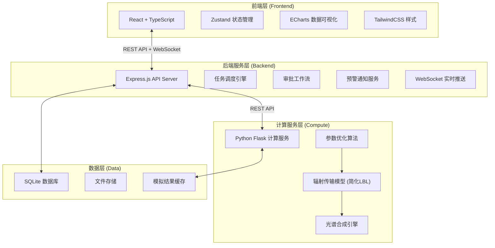
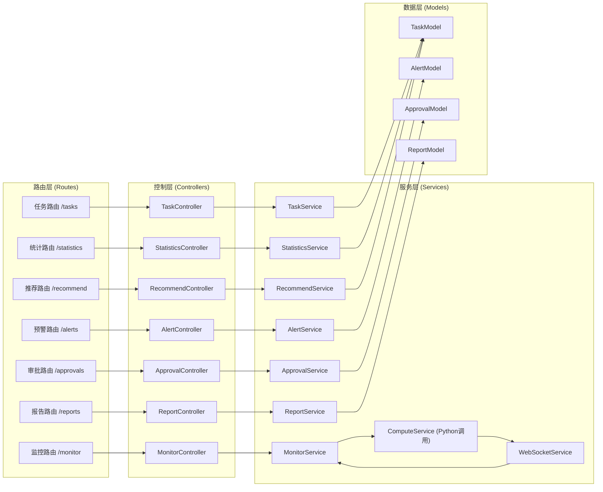
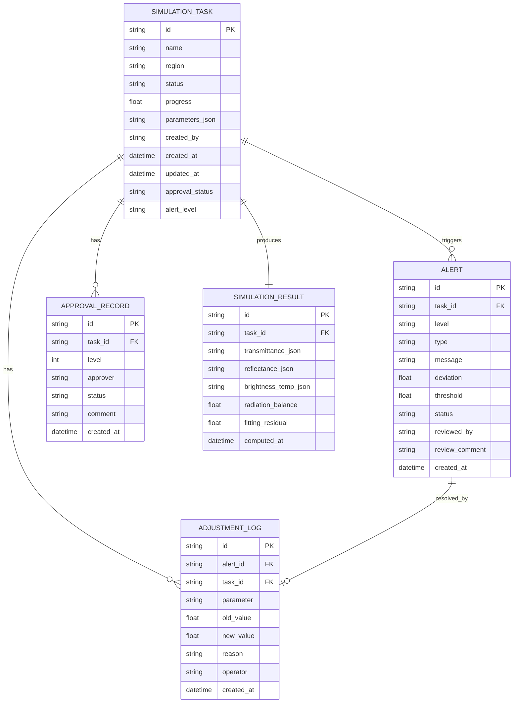

## 1. 架构设计

系统采用前后端分离 + 计算服务独立部署的三层架构，前端使用 React 构建专业级可视化界面，后端使用 Node.js/Express 提供 API 服务，Python 计算服务负责辐射传输物理计算，三者通过 REST API 和 WebSocket 进行通信。



## 2. 技术描述

- **前端框架**：React@18 + TypeScript + Vite
- **状态管理**：Zustand
- **路由**：React Router DOM@6
- **样式方案**：TailwindCSS@3
- **UI 组件**：自定义组件 + Lucide React 图标
- **图表库**：ECharts@5
- **后端框架**：Express@4 + TypeScript
- **计算服务**：Python 3.10 + Flask
- **数据库**：SQLite3（开发环境）
- **实时通信**：Socket.io
- **PDF 生成**：jsPDF + html2canvas（前端）
- **构建工具**：Vite@5

## 3. 路由定义

| 路由路径 | 页面名称 | 用途描述 |
|----------|----------|----------|
| `/dashboard` | 工作台 | 概览统计、快捷入口、预警面板、性能趋势 |
| `/tasks` | 任务管理 | 任务列表、筛选搜索、状态查看 |
| `/tasks/create` | 创建任务 | 分步向导：上传数据→配置参数→确认提交 |
| `/tasks/:id` | 任务详情 | 任务全量信息、状态时间线、计算结果 |
| `/monitor` | 实时监控 | 大气透过率、地表反射率、亮温监控图表 |
| `/alerts` | 预警中心 | 预警列表、详情、复核操作 |
| `/approval` | 审批中心 | 待审批、审批操作、审批历史 |
| `/reports` | 报告中心 | 报告列表、预览、PDF 导出 |
| `/recommend` | 智能推荐 | 波段推荐、参数推荐、历史分析 |
| `/statistics` | 统计看板 | 完成率、精度、资源消耗统计 |
| `/` | 重定向 | 重定向到 `/dashboard` |

## 4. API 定义

### 4.1 任务管理 API

```typescript
// 任务状态枚举
type TaskStatus = 'pending' | 'modeling' | 'computing' | 'synthesizing' | 'completed' | 'failed' | 'rollback';

// 任务信息
interface SimulationTask {
  id: string;
  name: string;
  region: string;
  status: TaskStatus;
  progress: number;
  createdAt: string;
  updatedAt: string;
  createdBy: string;
  parameters: TaskParameters;
  results?: SimulationResults;
  approvalStatus: 'none' | 'pending_first' | 'approved_first' | 'pending_second' | 'approved' | 'rejected';
  alertLevel?: 'level1' | 'level2' | 'level3' | null;
}

interface TaskParameters {
  profileFile: string;
  surfaceType: string;
  aerosolModel: string;
  wavelengthRange: [number, number];
  spectralResolution: number;
  observationAngle: number;
}

interface SimulationResults {
  transmittance: SpectrumData[];
  reflectance: SpectrumData[];
  brightnessTemperature: ChannelData[];
  radiationBalance: number;
  fittingResidual: number;
}

// GET /api/tasks - 获取任务列表
// 请求参数: page, pageSize, status, region, keyword
// 响应: { list: SimulationTask[], total: number }

// POST /api/tasks - 创建任务
// 请求体: { name, region, parameters, files }
// 响应: SimulationTask

// GET /api/tasks/:id - 获取任务详情
// 响应: SimulationTask

// PUT /api/tasks/:id/restart - 重启任务
// 响应: SimulationTask
```

### 4.2 监控数据 API

```typescript
// GET /api/monitor/realtime?taskId=xxx - 获取实时监控数据
// 响应: {
//   timestamp: string;
//   transmittance: { wavelength: number; value: number }[];
//   reflectance: { wavelength: number; value: number }[];
//   brightnessTemp: { channel: string; value: number }[];
//   radiationBalance: number;
//   fittingResidual: number;
// }

// WebSocket 事件: 'monitor:update' - 实时推送监控数据
```

### 4.3 预警 API

```typescript
interface Alert {
  id: string;
  taskId: string;
  taskName: string;
  level: 'level1' | 'level2' | 'level3';
  type: 'radiation_balance' | 'fitting_residual' | 'region_deviation';
  message: string;
  deviation: number;
  threshold: number;
  createdAt: string;
  status: 'pending' | 'reviewed' | 'resolved';
  reviewedBy?: string;
  reviewComment?: string;
  adjustment?: AdjustmentLog;
}

interface AdjustmentLog {
  id: string;
  alertId: string;
  parameter: string;
  oldValue: number;
  newValue: number;
  reason: string;
  operator: string;
  createdAt: string;
}

// GET /api/alerts - 获取预警列表
// PUT /api/alerts/:id/review - 复核预警
// 请求体: { action: 'adjust' | 'ignore', comment: string, adjustment? }
```

### 4.4 审批 API

```typescript
interface ApprovalRecord {
  id: string;
  taskId: string;
  level: 1 | 2;
  approver: string;
  status: 'approved' | 'rejected' | 'pending';
  comment: string;
  createdAt: string;
}

// GET /api/approvals/pending - 获取待我审批
// PUT /api/approvals/:id - 审批操作
// 请求体: { status: 'approved' | 'rejected', comment: string }
// GET /api/approvals/history - 审批历史
```

### 4.5 报告 API

```typescript
// GET /api/reports/:taskId - 获取报告数据
// POST /api/reports/:taskId/generate - 生成报告
// GET /api/reports/:taskId/pdf - 下载 PDF
// POST /api/reports/export - 导出数据
// 请求体: { taskIds, sensorType, observationGeometry, timeWindow }
```

### 4.6 统计 API

```typescript
// GET /api/statistics/overview - 概览统计
// 响应: { totalTasks, completedTasks, successRate, avgAccuracy }

// GET /api/statistics/completion-rate - 完成率趋势
// GET /api/statistics/accuracy - 精度统计
// GET /api/statistics/resources - 资源消耗统计
```

### 4.7 智能推荐 API

```typescript
// GET /api/recommend/bands?region=xxx - 推荐波段组合
// GET /api/recommend/parameters?surfaceType=xxx - 推荐参数
```

## 5. 服务器架构图



## 6. 数据模型

### 6.1 ER 图



### 6.2 数据初始化

系统启动时自动初始化模拟数据，包含：
- 10-15 个示例任务（覆盖各状态）
- 5-8 条预警记录
- 若干审批记录
- 历史统计数据（近30天）
- 区域偏差监控数据
